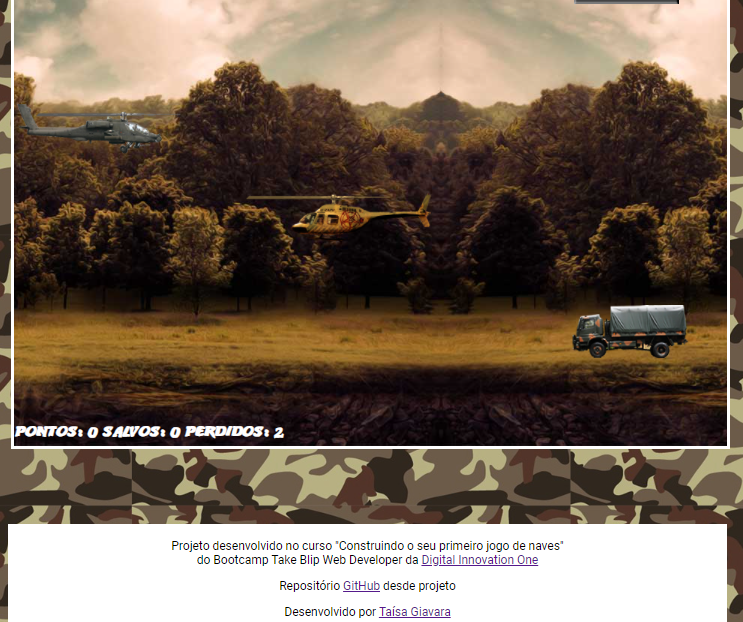

<!--Banner session-->

  

<!--About session-->
<h1 align="center">Construindo o seu primeiro jogo de naves Digital Innovation One</h1>

Curso do Bootcamp Take Blip Web Developer da [Digital Innovation One](https://digitalinnovation.one/).

Com o Bootcamp Take Blip Web Developer, você aprenderá o melhor de JavaScript – uma linguagem que entrega uma aplicação de ponta a ponta do Back-end ao Front-end (web ou mobile). Este Bootcamp faz parte do programa Órbi Academy Techboost, iniciativa da DIO junto ao Órbi Conecta, programa o qual oferecerá mais de 130 mil bolsas gratuitas de estudo em carreiras de tecnologia até 2022, fortalecendo ainda mais a comunidade tech brasileira.

- Projeto desenvolvido 

<h3>👨‍💻 Tecnologias utilizadas</h3>

- HTML
- CSS
- JavaScript
- jQuery

<!--Bottom session-->
 <h4 align=center>Made with by <a target="_blank" href="" >Taísa Giavara</a></h4>
